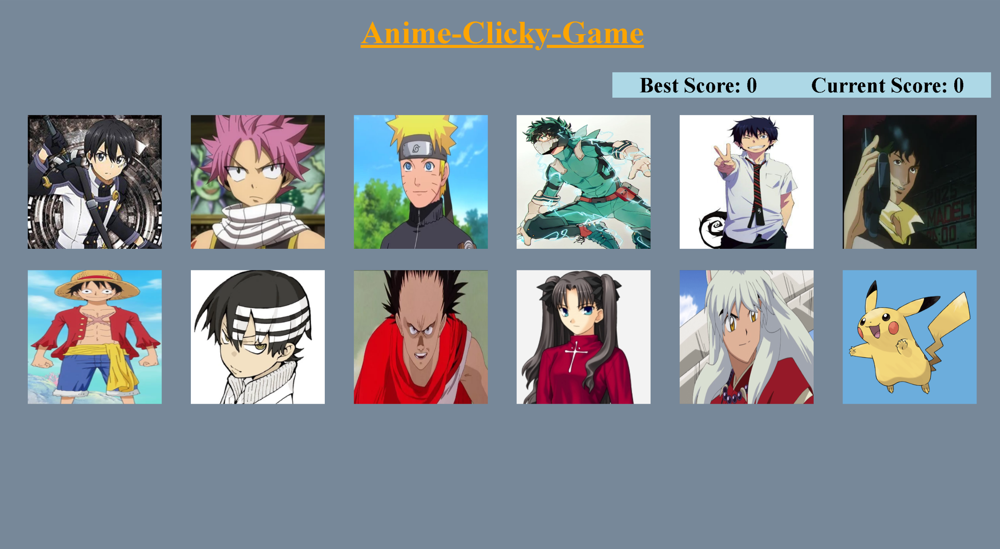

# Anime Clicky Game

## Introduction
This project is created in React. Using components for the image containers. Utilize the state to keep track of shuffle images. 

## Instructions
This is a memory game. Select an anime character tile and never pic the same one twice. Can you do all 12? 

## Tech used
* React
* CSS
* JSX

<h2> Future Development </h2>

* Apply mobile resposiveness.
* Create a div that display message if card is double clicked or just clicked once. 

<h2> Examples </h2>

